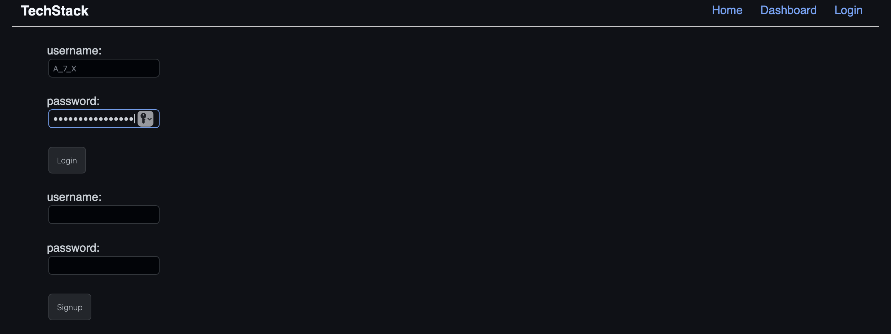
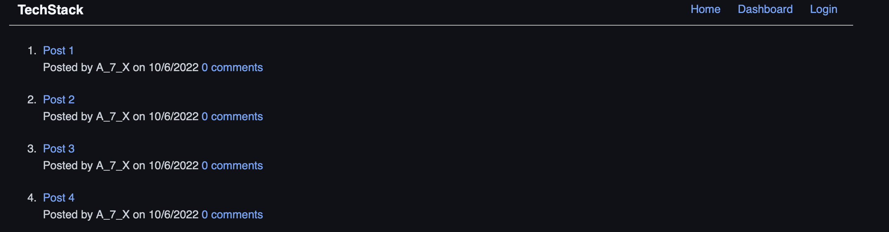
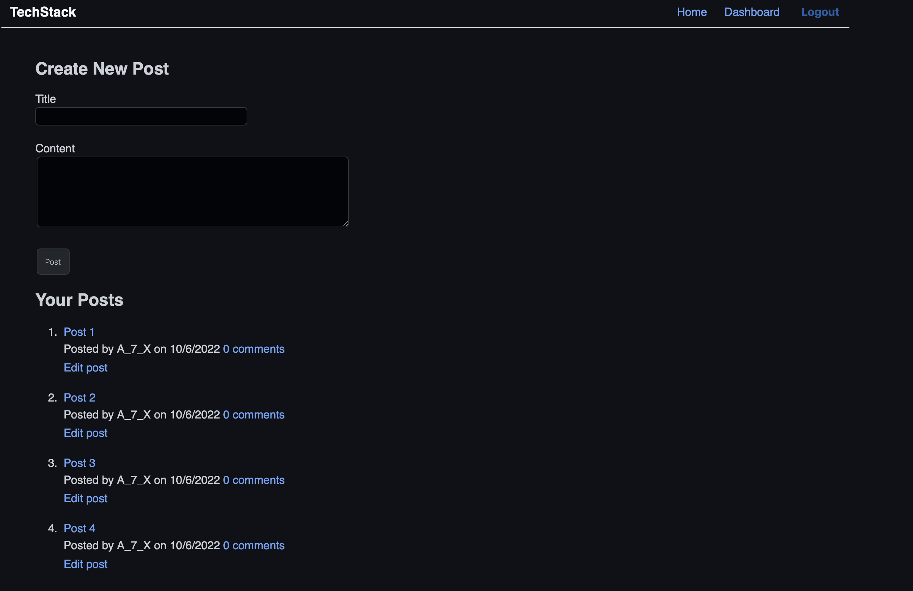

# Tech-Stack

## Description

Tech-Stack is a blog website developed following the MVC paradigm in its architectural structure, using `Handlebars.js` as the templating language, `Sequelize` as the ORM, and the `express-session` npm package for authentication. Developers can use the application to publish their blog posts and comment on other developers’ posts as well.

## Table of Contents

- [Description](#description)
- [Demo](#demo)
- [Testing](#test)
- [License](#license)
- [Tech Stack](#technologies)
- [Feedback](#feedback)

 

## Demo

### Login/Sign up Screen:

 

### Home Screen (for existing users):

 

### User Dashboard:

 

## Test

    – To test and use the app on your local machine follow the instructions:
        • Clone the repository
        • Ensure you are in the project directory
        • Run "npm i" or "npm install" to install the required packages
        • Run "mysql -u root -p" and enter your credentials when/if prompted
        • Then run "source schema.sql;" followed by "npm run seeds"
        • Run "npm start" and open the app in the browser
        
### Live Deployment:
If you prefer you can also test the app by [CLICKING HERE](https://tech-stack-feed.herokuapp.com) to access it.

## License

This project is licensed under the MIT License.

## Technologies

    – Libraries:
        • dotenv
        • bcrypt package
        • express
        • express-session
        • express-handlebars
        • sequelize
        • connect-session-sequelize
        • MySQL2

## Feedback

GitHub: [github.com/rfabreu](https://github.com/rfabreu)  
Comments, suggestions, questions? Contact me at: [rafael.gomes@mail.utoronto.ca](mailto:rafael.gomes@mail.utoronto.ca)  
Use the App: [Check it out!](https://tech-stack-feed.herokuapp.com)